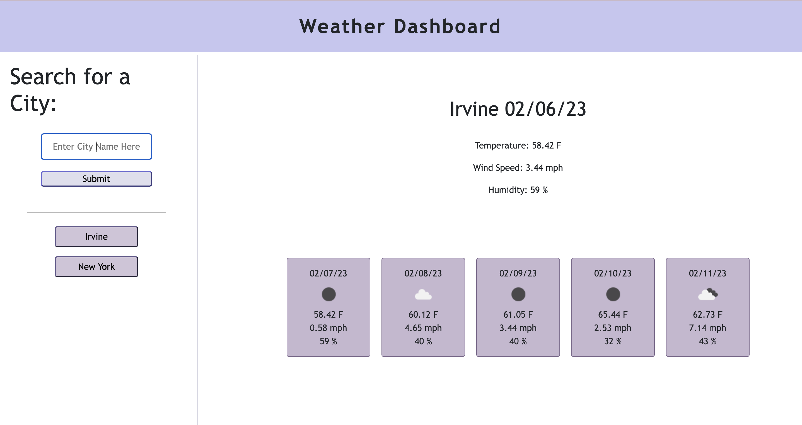

# Weather Dashboard
#### Aubrey Johnston
 

## Technologies Used
<ul>
    <li>HTML</li>
    <li>CSS</li>
    <li>Javascript</derli>
</ul>    

 

## Description
The purpose of this site is to allow users to check the current and forecasted weather of any city they would like. They will be able to see the temperature, windspeed, humidity, and date of each forecasted day. They will also see icons representing the weather for each of the five forecasted days.

 

## Installation
No installation required. Just visit the deployed website link:
 
https://aubreyj11.github.io/weather-dashboard/

 

## Usage
Enter the name of the city you wish to find the  weather conditions of in the input box and press submit. The current weather conditions for that city will be displayed along with a five day forecast. A button will appear under the input box with the name of the city that was just searched and will allow the user to click that button for quick and easy access back to that city's weather conditions.
   
